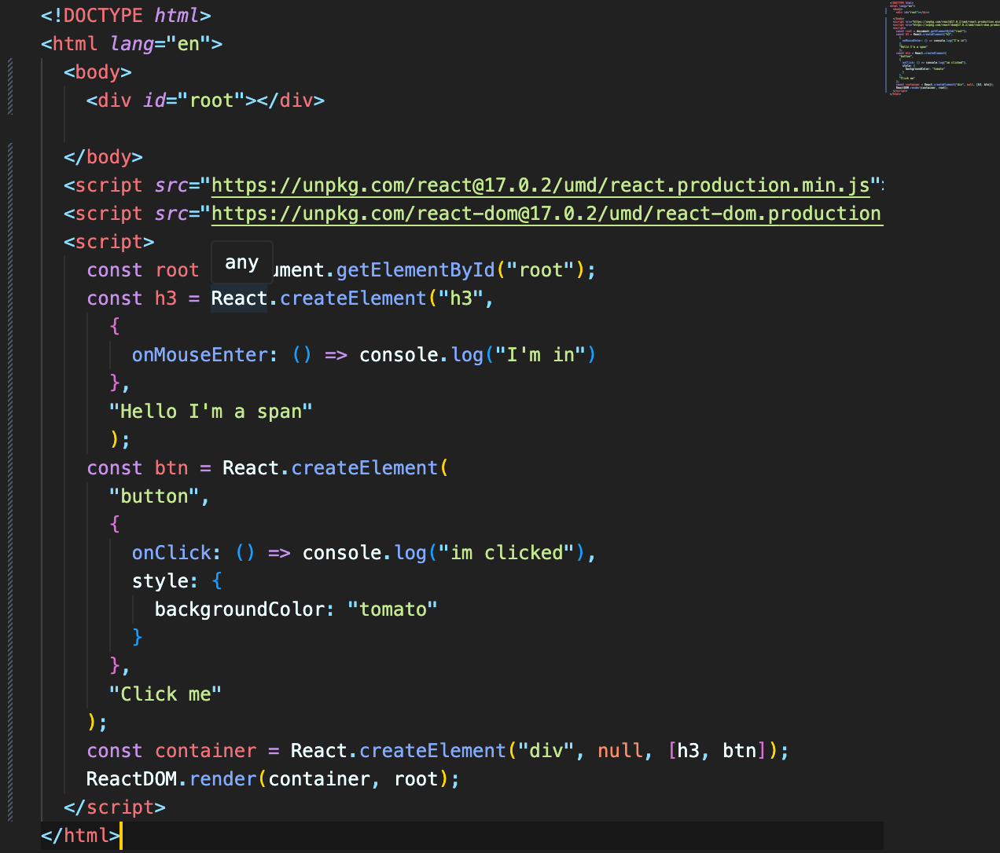
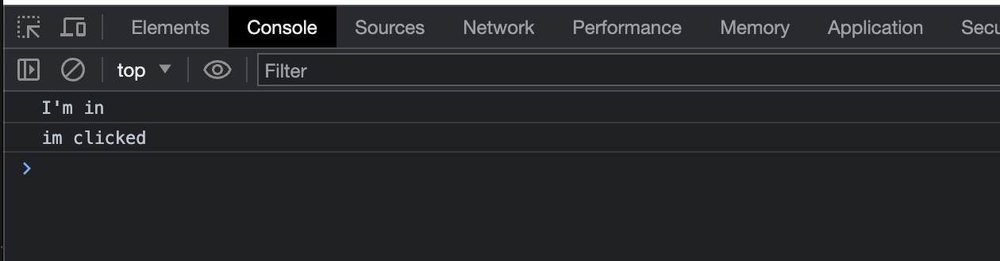
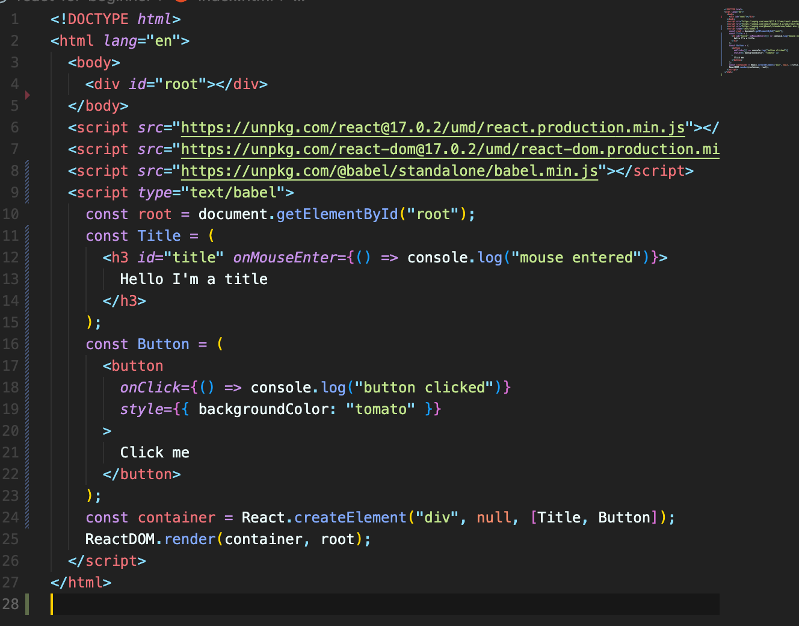

# ReactJS로 영화 웹 서비스 만들기

# 2 THE BASICS OF REACT

### 2.0 Introduction

리액트는 interactive한 웹사이트를 만들기 위해서 쓴다.

 

### 2.1 Before React

바닐라 js를 이용한 코드 작성을 해봄.

 

### 2.2 Our First React Element

HTML을 이용하지 않고 javascript 와 ReactJS만을 이용해서 element를 생성할 것이다.

ReactJS는 HTML을 생성한다.
ReactJS는 엔진. Interactive한 UI를 만들 수 있게 함.

ReactDOM is library (or package). It makes all React Elements can be into HTML body.

- `ReactDOM.render([리액트 요소])` : 리액트 요소를 HTML 요소로 만들어 배치한다는 뜻. 사용자에게 보여지도록 하는 것.

 

### 2.3 Events in React

eventListener 대신에 React에서 바로 event 관리하는 방법.

코드 작성

property 자리에 object로 넣어주면 됨. (props?)

결과

h3 위에 마우스를 올리거나 버튼을 클릭하면 console에 찍힌다.

 

### 2.4 Recap

개발자로서 앞으로 이렇게 프로그램을 짤 일은 없다. 즉, 앞으로는 createElement를 사용하지 않는다.(다른 방법 사용.)

 

### 2.5 JSX (JavaScript XML)

HTML에서 사용한 문법과 비슷한 문법으로 리액트 요소를 만들 수 있게 해준다.

코드 작성

아래 형식으로 작성하고 babel을 설치하면 JSX 문법을 사용할 수 있다.

https://unpkg.com/@babel/standalone/babel.min.js
