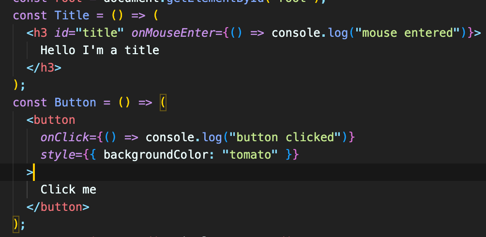
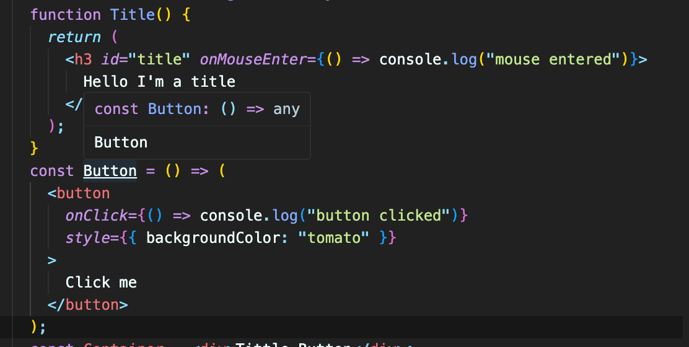
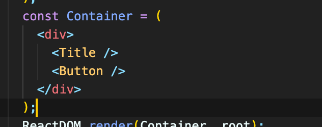
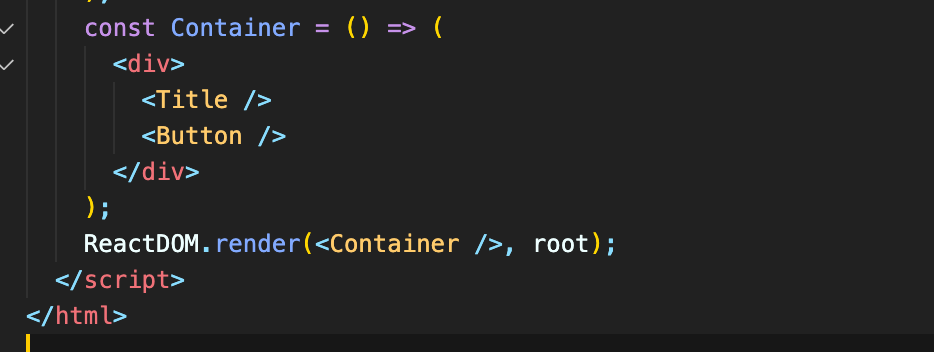
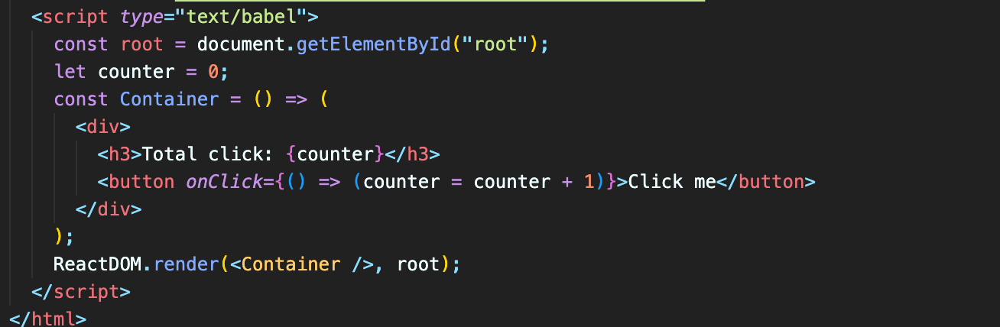
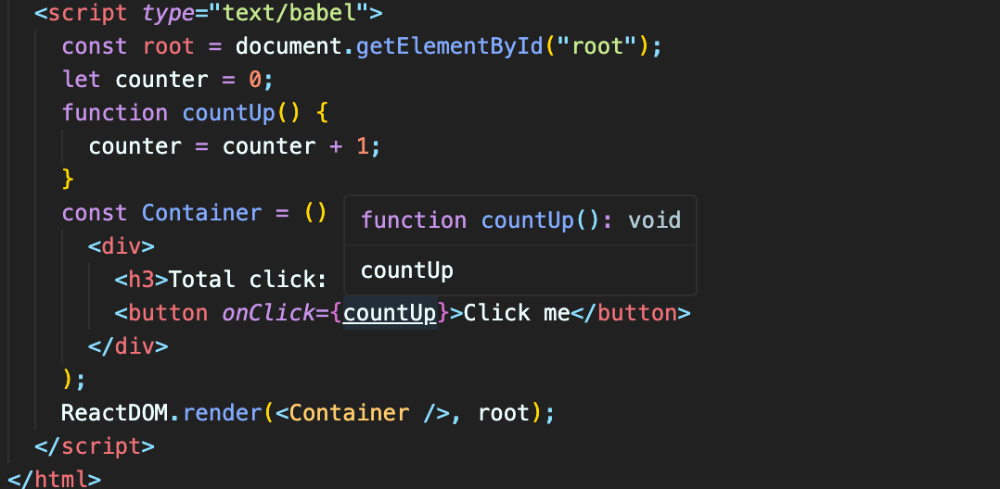
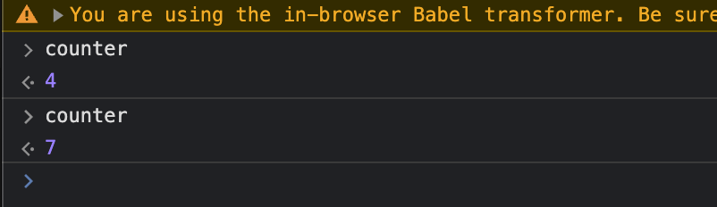
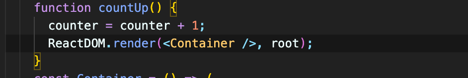

# ReactJS로 영화 웹 서비스 만들기

## 목차

- [ReactJS로 영화 웹 서비스 만들기](#reactjs로-영화-웹-서비스-만들기)
  - [목차](#목차)
- [2 THE BASICS OF REACT](#2-the-basics-of-react)
  - [- 2.0 Introduction](#--20-introduction)
  - [- 2.1 Before React](#--21-before-react)
  - [- 2.2 Our First React Element](#--22-our-first-react-element)
  - [- 2.3 Events in React](#--23-events-in-react)
  - [- 2.4 Recap](#--24-recap)
  - [- 2.5 JSX (JavaScript XML)](#--25-jsx-javascript-xml)
  - [- 2.6 JSX part Two](#--26-jsx-part-two)
- [3 STATE](#3-state)
  - [- 3.0 Understanding State](#--30-understanding-state)

# 2 THE BASICS OF REACT

### - 2.0 Introduction

리액트는 interactive한 웹사이트를 만들기 위해서 쓴다.

 

### - 2.1 Before React

바닐라 js를 이용한 코드 작성을 해봄.

 

### - 2.2 Our First React Element

HTML을 이용하지 않고 javascript 와 ReactJS만을 이용해서 element를 생성할 것이다.

ReactJS는 HTML을 생성한다.
ReactJS는 엔진. Interactive한 UI를 만들 수 있게 함.

ReactDOM is library (or package). It makes all React Elements can be into HTML body.

- `ReactDOM.render([리액트 요소])` : 리액트 요소를 HTML 요소로 만들어 배치한다는 뜻. 사용자에게 보여지도록 하는 것.

 

### - 2.3 Events in React

eventListener 대신에 React에서 바로 event 관리하는 방법.

코드 작성

property 자리에 object로 넣어주면 됨. (props?)

결과

h3 위에 마우스를 올리거나 버튼을 클릭하면 console에 찍힌다.

 

### - 2.4 Recap

개발자로서 앞으로 이렇게 프로그램을 짤 일은 없다. 즉, 앞으로는 createElement를 사용하지 않는다.(다른 방법 사용.)

 

### - 2.5 JSX (JavaScript XML)

HTML에서 사용한 문법과 비슷한 문법으로 리액트 요소를 만들 수 있게 해준다.

코드 작성

아래 형식으로 작성하고 babel을 설치하면 JSX 문법을 사용할 수 있다.

https://unpkg.com/@babel/standalone/babel.min.js

 

### - 2.6 JSX part Two

먼저, Title과 Button을 함수로 만들어 준다.

`() =>` 쓰면 함수로 만들어 줄 수 있음(arrow funtion)

이렇게 return 써서 함수 만드는 거랑 완전히 같음.

컴포넌트의 이니셜은 반드시 대문자로.
저 노란색 자리에 return 값이 들어간다고 생각하면 됨. 실제로 컴포넌트를 나누지 않고 저기다 그냥 한번에 적어도 상관 없음.

마지막으로 Container도 함수로 만들어주고 컴포넌트를 렌더링 하면 된다.

 

# 3 STATE

### - 3.0 Understanding State

변수들을 JSX에 전달하는 방법을 알아야 한다.

혹은 함수를 새로 만들어서

버튼을 누를 때마다 counter가 바뀌도록 설정.

UI는 변하지 않지만 counter는 제대로 증가하고 있는 것을 확인.

countUp 함수가 실행될 때 마다 re-rendering 시켜주면 ui도 새로고침 된다.

아예 render라는 함수를 새로 정의해서 사용.
