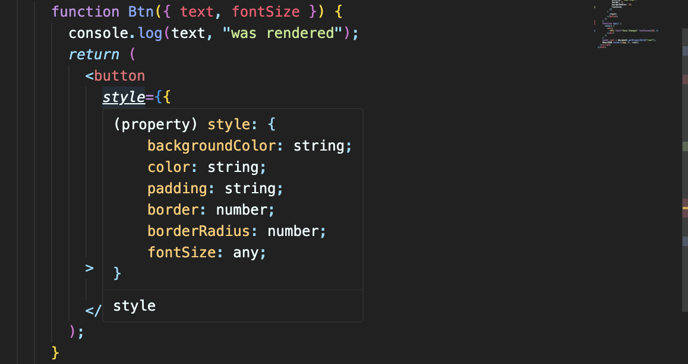

# ReactJS로 영화 웹 서비스 만들기

- [ReactJS로 영화 웹 서비스 만들기](#reactjs로-영화-웹-서비스-만들기)
- [2 THE BASICS OF REACT](#2-the-basics-of-react)
  - [- 2.0 Introduction](#--20-introduction)
  - [- 2.1 Before React](#--21-before-react)
  - [- 2.2 Our First React Element](#--22-our-first-react-element)
  - [- 2.3 Events in React](#--23-events-in-react)
  - [- 2.4 Recap](#--24-recap)
  - [- 2.5 JSX (JavaScript XML)](#--25-jsx-javascript-xml)
  - [- 2.6 JSX part Two](#--26-jsx-part-two)
- [3 STATE](#3-state)
  - [- 3.0 Understanding State](#--30-understanding-state)
  - [- 3.1 setState part One](#--31-setstate-part-one)
  - [- 3.2 setState part Two](#--32-setstate-part-two)
  - [- 3.3 Recap](#--33-recap)
  - [- 3.4 State Function](#--34-state-function)
  - [- 3.5 Input and State](#--35-input-and-state)
  - [- 3.6 State Practice part One](#--36-state-practice-part-one)
  - [- 3.7 State Practice part Two](#--37-state-practice-part-two)
  - [- 3.8 Recap](#--38-recap)
  - [- 3.9 Final Practice and Recap](#--39-final-practice-and-recap)
- [4 PROPS](#4-props)
  - [- 4.0 props](#--40-props)
  - [- 4.1 Memo](#--41-memo)
  - [- 4.2 Props Types](#--42-props-types)
  - [- 4.3 Recap](#--43-recap)

# 2 THE BASICS OF REACT

### - 2.0 Introduction

리액트는 interactive한 웹사이트를 만들기 위해서 쓴다.

 

### - 2.1 Before React

바닐라 js를 이용한 코드 작성을 해봄.

 

### - 2.2 Our First React Element

HTML을 이용하지 않고 javascript 와 ReactJS만을 이용해서 element를 생성할 것이다.

ReactJS는 HTML을 생성한다.
ReactJS는 엔진. Interactive한 UI를 만들 수 있게 함.

ReactDOM is library (or package). It makes all React Elements can be into HTML body.

- `ReactDOM.render([리액트 요소])` : 리액트 요소를 HTML 요소로 만들어 배치한다는 뜻. 사용자에게 보여지도록 하는 것.

 

### - 2.3 Events in React

eventListener 대신에 React에서 바로 event 관리하는 방법.

코드 작성

property 자리에 object로 넣어주면 됨. (props?)

결과

h3 위에 마우스를 올리거나 버튼을 클릭하면 console에 찍힌다.

 

### - 2.4 Recap

개발자로서 앞으로 이렇게 프로그램을 짤 일은 없다. 즉, 앞으로는 createElement를 사용하지 않는다.(다른 방법 사용.)

 

### - 2.5 JSX (JavaScript XML)

HTML에서 사용한 문법과 비슷한 문법으로 리액트 요소를 만들 수 있게 해준다.

코드 작성

아래 형식으로 작성하고 babel을 설치하면 JSX 문법을 사용할 수 있다.

https://unpkg.com/@babel/standalone/babel.min.js

 

### - 2.6 JSX part Two

먼저, Title과 Button을 함수로 만들어 준다.

`() =>` 쓰면 함수로 만들어 줄 수 있음(arrow funtion)

이렇게 return 써서 함수 만드는 거랑 완전히 같음.

컴포넌트의 이니셜은 반드시 대문자로.
저 노란색 자리에 return 값이 들어간다고 생각하면 됨. 실제로 컴포넌트를 나누지 않고 저기다 그냥 한번에 적어도 상관 없음.

마지막으로 Container도 함수로 만들어주고 컴포넌트를 렌더링 하면 된다.

 

# 3 STATE

### - 3.0 Understanding State

변수들을 JSX에 전달하는 방법을 알아야 한다.

혹은 함수를 새로 만들어서

버튼을 누를 때마다 counter가 바뀌도록 설정.

UI는 변하지 않지만 counter는 제대로 증가하고 있는 것을 확인.

countUp 함수가 실행될 때 마다 re-rendering 시켜주면 ui도 새로고침 된다.

아예 render라는 함수를 새로 정의해서 사용.

여기서 바닐라 js랑 차이점은, counter가 바뀌면서 span 전체가 새로고침 되는게 아니라 {counter} 부분만 re-rendering 된다.

 

### - 3.1 setState part One

이제 React.js 어플 내에서 데이터를 보관하고 자동으로 리랜더링을 일으킬 수 있는 방법을 배운다.(트리거가 발동해서 리랜더링 시켜줌)

(일단 데이터를 let 변수에 담는 것이 기존의 컨셉이었다.)

- `React.useState([초기값])`
  
  여기서 undifined 된 부분이 데이터고, 뒤에 f가 data를 바꿀때 하용하는 함수.

> - 배열에서 item을 꺼내서 각각의 변수에 담는 법
>   
>   이렇게 하면 myFavFood는 tomato가 되고, mySecondFavFood는 potato가 된다.

배열에 이름을 붙여줌.

 

### - 3.2 setState part Two

counter가 바뀌기 때문에 let으로 바꿔주고, 버튼에 이벤트 리스너 달고, 함수 만들어서 실행시켜주면 counter가 잘 올라가고 있다.

이까지는 앞과 동일하고, 어떻게 리랜더링 시켜줄 것인지가 문제.

- modifier function : 데이터를 그 값으로 업데이트 한 후 자동으로 리랜더링을 일으킨다.

다시 const로 선언한 거 잘 봐라. modifier로 데이터 값을 바꾸면 const로 선언해도 된다.

 

### - 3.3 Recap

React.js에서는 데이터가 바뀔때마다 컴포넌트를 리랜더링하고 UI를 refresh한다.

 

### - 3.4 State Function

- `[function name]([현재 값] => [현재 값에 연산])` :
  이전 데이터를 바탕으로 새로운 데이터를 설정하고 싶다면,
  
  이렇게 계산하는 것이 안전하다. 왜냐면 current값이 변질되지 않은 현재 값이라는 것을 보증해주기 때문.

 

### - 3.5 Input and State

분->시간 단위 바꾸기

<small>lable -> label 오타 수정</small>

JSX에서 이렇게는 안됨. for은 javascript에서 사용되는 언어이므로 html에서 사용하듯이 property를 추가할 수 없다. class도 똑같이 쓸 수 없음.

class는 className으로,
for은 htmlFor로 사용해야 함.

- uncontrolled :
  input의 value를 통제할 수 없기 때문에 React.js에서 이러한 input을 uncontrolled라고 한다.
  

코드 작성

event 이용하는 건 javascript에서랑 똑같이 하면 됨.

 

### - 3.6 State Practice part One

코드 작성

### - 3.7 State Practice part Two

flip function을 이용해서 단위 변환의 반대과정(시 --> 분)을 구현한다.

onFlip 함수가 작동하면 state 함수가 작동해서 flipped 값을 반대로 뒤집는다.

하지만 앞에서말했듯이 state의 계산을 데이터를 바탕으로 하는 것은 좋지 못하다.
current value를 사용하는게 좋음.

disabled 까지 작성해주면 button은 제대로 동작함.

- 삼항연산자 (`[조건] ? [참일때 출력] : [거짓일때 출력]`)

코드 작성

 

### - 3.8 Recap

삼항연산자로 버튼 이쁘게 만들 수 있음.

 

### - 3.9 Final Practice and Recap

select에 따라 다른 단위를 변환할 수 있도록 App을 구현할 예정이다.

JSX에서 javascript 코드는 { }안에서 작성할 수 있다.

삼항연산자 사용.

세개 이상의 단위 변환이 있으면 이렇게 사용.

 

# 4 PROPS

### - 4.0 props

두개의 버튼을 생성 했는데, 각 componet를 따로 생성해서 같은 style임에도 불구하고 두번 적어야 함.

이를 해결해주는게 props.
props는 내가 정한 component를 불러올 때 argument로 사용되는 녀석임.

여기서는 {banana:"Save Changes"}, {banana:"Continue"} 형태의 오브젝트로 날아감.

javascript 언어로 보내줄 때는 { }안에다 담아서 보내주기.

- shortcut
  
  argument 자리에 { }로 쓰는 형태를 shortcut이라 하고. props보다 더 자주 쓰인다.

  여러 데이터를 한번에 가져올 때는 `{ [a],[b], ... }` 이런 식으로 써주면 됨.
  

fontSize에서 3항연산자 이용하면 cool

 

### - 4.1 Memo

커스텀 컴포넌트에다가 이렇게 쓰면 onClick 이벤트 리스너가 아니라 props로 날아감.

이 버튼 element 안에 onClick event를 추가해야 함.

onClick을 shortcut으로 가져와서 button에 이벤트 리스너 추가.

헷갈리니까 이름도 바꿔주기

text, boolean은 물론, function까지 보낼 수 있는 것 확인.

- React Memo : 바뀌는 부분이 없을 때, 리랜더링 하지 않을 부분을 정해주는 거.

  여기서 Btn 위에꺼 클릭하면 자기 자신은 바뀌는게 있는데 밑에 Continue 버튼은 안바뀜. 이럴 때 리랜더링에서 제외시키려고 함.

- `React.memo(Btn)`
  
  Btn을 memo 이용해서 MemorizedBtn으로 만들어주고, MemorizedBtn 컴포넌트를 App에서 불러옴.
  
  버튼을 클릭하고 console 확인하면 Continue 버튼은 리랜더링 되지 않은 것을 볼 수 있다.

  당장 쓰진 않을 수 있지만, React가 어떻게 동작하는지 이해하는데 도움이 된다.

 

### - 4.2 Props Types

> 
> 앞서 함수에는 { }씌워서 썼는데 fontSize는 숫자로 받아서 그런지 { } 중괄호 안 쓰네...
> 
> 심지어 fontSize 이름이 같아서 이렇게 써도 적용 된다구 함..

- PropType은 어떤 type의 props를 받고 있는지 체크해주는 툴 같은 거.
  
  PropTypes설치할 땐 이거 react랑 reactDOM development.js로 바꿔줘야 함.

이제 React에게 나는 type을 이렇게 쓸 거라고 설명해주는 부분.

대소문자 구분 유의하기.

type이 잘못됐다고 경고 문구 띄워줌.

- `.isRequired` : props에서 반드시 필요한 거 지정.
  
  

이렇게 필수가 아닌 fontSize에 default 값을 줄 수도 있다. 이건 react가 아니라 javascript임.

 

### - 4.3 Recap
